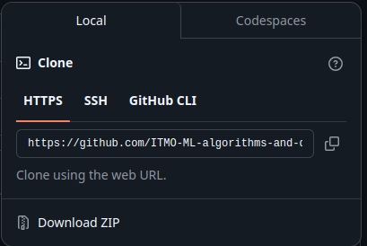
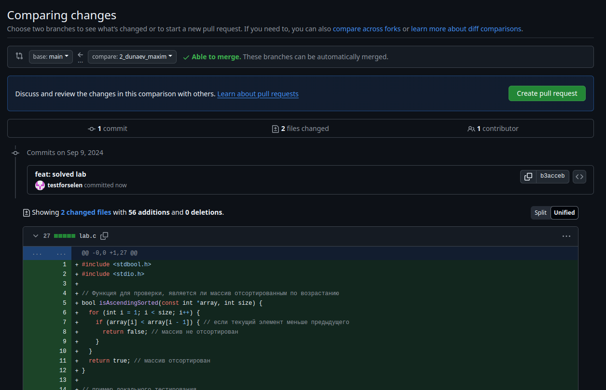
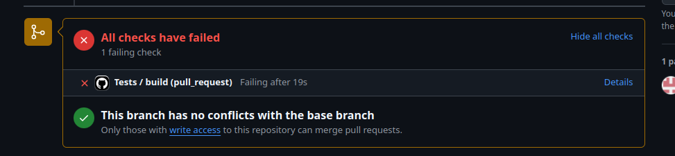

# Добро пожаловать!  

Приветствуем прибывших, получайте удовольствие от программирования, ведь это классно!

# Называем PR по паттерну Поток_Имя_Фамилия_#Лабораторной

### Для начала работы
1. Сделайте форк репозитория. Кнопочка Fork (в правом верхнем углу) 
2. Скопируйте репозиторий (кнопочка Code и там клонируете ссылку)
  

3. Представьтесь, это важно
```bash
git config user.email "my@email.com"
```

#### Представляйтесь реальным именем
Это в дискорде вы NyashnyuKotik222, а здесь, будьте добры - Иван Иванович Иванов. Вас 140 человек, и вас нужно идентифицировать
```bash
git config user.name "IvanIvanov333"
```

4. Далее самое простое - решаем лабу, пишем тесты.    
5. Создаем ветку - в формате <group_id>_<surname>_<name>  
Можно так
```bash
git branch 2_dunaev_maxim 
```
(переключиться можно так, а вообще читайте доку, смотрите видосики)   
```bash
git switch 2_dunaev_maxim 
```
6. Создаём PR  


[Пример PR](https://github.com/ITMO-ML-algorithms-and-data-structures/polygon/pull/2)

Не забываем - проверить, что тесты прошли!  
Вот так вот не надо  

